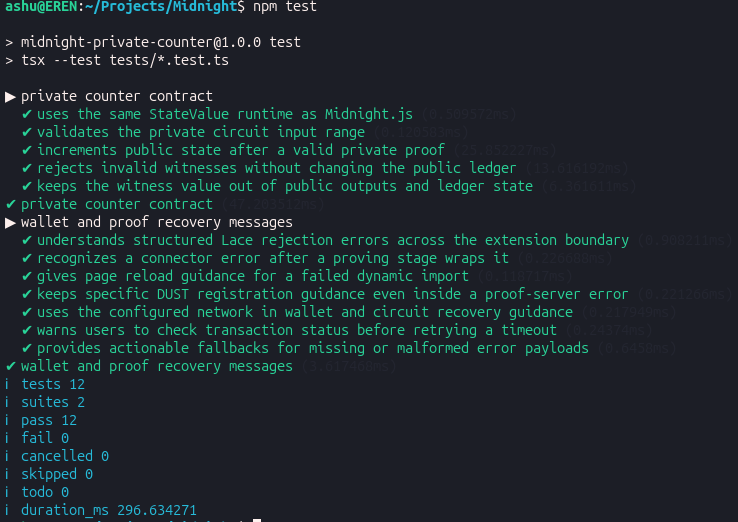
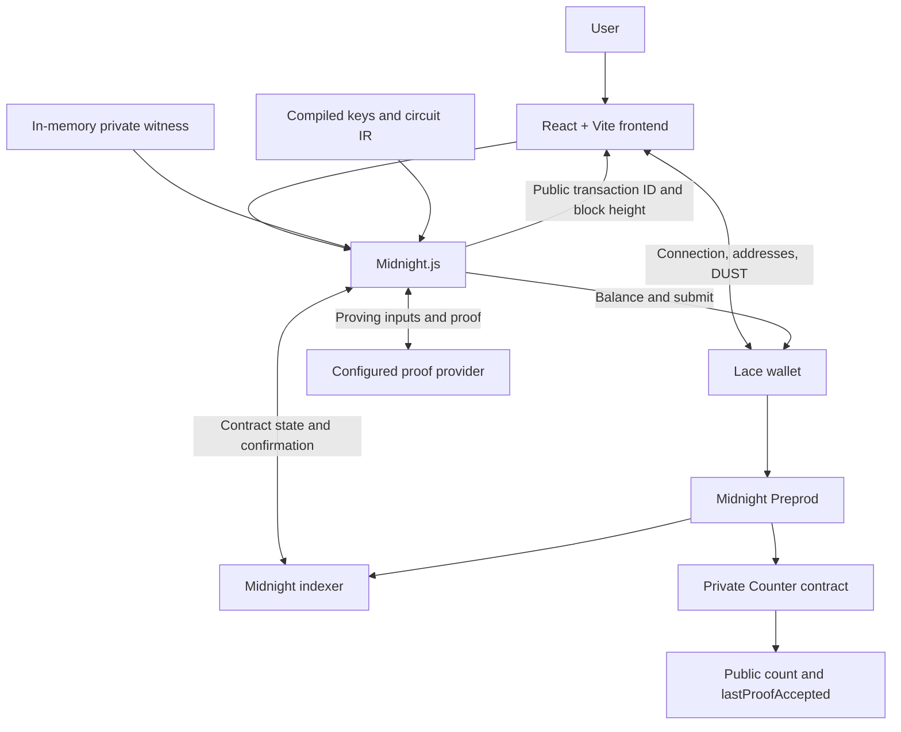

# Midnight Private Counter

> Prove a private value is valid, advance a public counter, and keep the witness off the public ledger.

## Live Demo

**[midnight-private-counter.vercel.app](https://midnight-private-counter.vercel.app)**

[Public GitHub repository](https://github.com/ashuujha/midnight-private-counter) · [Demo video](https://youtu.be/Ai-zfJ9eokw) · [GitHub Actions](https://github.com/ashuujha/midnight-private-counter/actions/workflows/ci.yml)

## Contract Address

| Network | Address |
|---|---|
| **Preprod** | `19710614a44cd723c34f79a913e20f2b8776d0bf8825c5b653c6cc25942a7d89` |

This is the contract configured in the live frontend and `.env.example`. A read-only Preprod indexer check confirmed its public state: `count = 5` and `lastProofAccepted = true` at block `2607602` on 19 September 2026. See the [verification record](docs/verification/preprod-counter.json) and [reproducible query](#on-chain-verification). This snapshot can change as further calls succeed.

## What This Does

Midnight Private Counter is an educational dApp for experiencing a real zero-knowledge transaction:

1. Connect Lace on Midnight Preprod.
2. Check that the wallet has registered tNIGHT for DUST generation and has a positive tDUST balance.
3. Select **Generate proof & increment**. The browser generates a private witness between `1` and `10` and invokes the deployed Compact circuit.
4. Follow the preparation and proving indicators, then approve the wallet's transaction request.
5. See the confirmed public transaction ID and block height.

Every successful circuit call increments the counter by **exactly one**. The private value determines whether the range condition is satisfied; it is not the amount added to the counter. Users do not type a secret into this demonstration.

The interface includes wallet connection and disconnection, DUST refresh, address copying, actionable failure messages, proof progress, and public/private explanation tabs. Its layout adapts to mobile screens, and ambient animations can be paused or disabled through the system's reduced-motion setting.


## Privacy Model

- **PUBLIC:** the contract address, `count`, `lastProofAccepted`, transaction metadata, transaction ID, and block height.
- **PRIVATE:** the generated `privateIncrement` witness used in the proving flow. It is stored in browser memory by the dApp, never displayed by the UI, and never written into the contract's public ledger state.
- **PROVED without revealing:** the witness is a `Uint<16>` in the inclusive range `1` through `10`, permitting one public counter increment.

The configured proof provider is part of the trust boundary: proving inputs may be sent to that service. “Private” here means hidden from the public ledger, not necessarily hidden from the browser, wallet, or prover.

## Privacy Claim

An on-chain observer sees that the circuit succeeded, the public counter advanced by one, and `lastProofAccepted` is `true`, along with public transaction metadata. The circuit does not publish the private witness in its ledger state or return value; the disclosed range-check result does not identify which allowed value was used.

The UI receives only `transaction.public.txId` and `transaction.public.blockHeight` from a successful call. The witness is not returned to React or included in the result panel.

This is a demonstration of selective disclosure, not a claim of transaction anonymity or proof of identity. The witness has a small, intentionally simple value range. A remote proof provider receives proving inputs, and the demo's in-memory storage is not an encrypted-backup system.

## Tech Stack

| Layer | Technology |
|---|---|
| Smart contract | Compact compiler **0.31.1** · language **0.23.0** |
| Contract runtime | `@midnight-ntwrk/compact-runtime` **0.16.0** |
| Blockchain | Midnight **Preprod** |
| dApp SDK | Midnight.js **4.1.1** · Compact.js **2.5.1** |
| Wallet | Lace · Midnight DApp Connector API **4.0.1** |
| Frontend | React **19.2.4** · TypeScript **5.9.3** · Vite **7.3.1** |
| Styling | Custom CSS · local fonts · WebP artwork |
| Tests | Node.js test runner through `tsx` |
| CI | GitHub Actions · Node.js **22** · Compact CLI **0.5.2** |
| Hosting | Vercel |

## Prerequisites

- **Node.js 22.x** and npm. The root package requires `>=22.0.0 <23`.
- **Lace wallet** with Midnight enabled and Preprod selected for real transactions.
- Preprod **tNIGHT registered for tDUST generation**, a positive DUST balance, and a synchronized wallet. See the [wallet-funding guide](https://docs.midnight.network/guides/acquire-tokens).
- **Compact compiler 0.31.1** to recompile the contract. See the [official toolchain installation guide](https://docs.midnight.network/getting-started/installation).
- **Docker** when using the documented local proof server, or access to a compatible hosted proof service.

The checked-in compiled artifacts let you start the frontend without recompiling. Local unit tests do not need a funded wallet or a running blockchain.

## Setup & Run Locally

### 1. Clone and install

```bash
git clone https://github.com/ashuujha/midnight-private-counter.git
cd midnight-private-counter
npm install
cp .env.example .env.local
```

### 2. Configure the network and contract

The defaults in `.env.local` are:

```dotenv
VITE_MIDNIGHT_NETWORK=preprod
VITE_CONTRACT_ADDRESS=19710614a44cd723c34f79a913e20f2b8776d0bf8825c5b653c6cc25942a7d89
```

| Variable | Purpose |
|---|---|
| `VITE_MIDNIGHT_NETWORK` | Network requested from Lace; defaults to `preprod` |
| `VITE_CONTRACT_ADDRESS` | Deployed counter's 64-character hexadecimal address |
| `VITE_PROOF_SERVER_URL` | Optional HTTP proof-provider endpoint; otherwise proving is delegated to Lace |

All `VITE_*` values are public browser-build configuration. Do not put credentials, wallet seeds, or recovery phrases in them. Restart the development server after changes; rebuild the hosted frontend when its configuration changes.

### 3. Configure proving

For a local proof server:

```bash
docker run --rm -p 127.0.0.1:6300:6300 \
  midnightntwrk/proof-server:8.1.0 midnight-proof-server -v
```

Set Lace's Midnight proof-server option to the local service. The dApp's circuit proof can instead use `VITE_PROOF_SERVER_URL` with a compatible hosted HTTPS endpoint that allows requests from the frontend origin. This variable does **not** change Lace's proof service: wallet balancing and DUST fee proofs still use Lace's own configuration. Vercel hosts the static frontend and proving assets; it does not run this Docker service.

### 4. Compile the contract

After installing the Compact CLI, select the matching compiler and compile:

```bash
compact update 0.31.1
compact compile --version
npm run compile
```

`npm run compile` executes `compact compile contracts/counter.compact managed/counter`. The generated bindings, keys, and circuit IR are written to `managed/counter/`.

### 5. Run the application

```bash
npm run dev
```

Open **http://localhost:5173**, connect Lace, and generate a proof. The pre-development script copies the proving assets into `public/keys` and `public/zkir`.

To check and preview a production build:

```bash
npm run build
npm run preview
```

The build type-checks the app and writes `dist/`. The preview server defaults to **http://localhost:4173**.

### Troubleshooting

| Symptom | Recovery |
|---|---|
| Lace not detected | Enable the extension and Midnight support, then reload |
| Connection or transaction rejected | Review and approve the next request in Lace |
| Network mismatch | Switch Lace to the configured network and reconnect |
| No DUST registration or zero DUST | Complete **Generate tDUST**, wait for accrual and wallet sync, then refresh |
| Proving tools cannot be downloaded | Check connectivity and reload the page before retrying |
| Proof-service failure | Check the configured endpoint or Lace proving settings |
| Request timeout | Check Lace for a pending or submitted transaction before retrying |

## Run Tests

```bash
npm test
```

The suite currently has **17 tests**:

- Five contract tests cover shared runtime identity, range boundaries, successful counter updates, rejection of invalid witnesses without state changes, and private-witness exclusion from public outputs.
- Twelve recovery-message tests cover structured Lace errors, wrapped disconnects, failed module downloads, DUST guidance, network selection, timeouts, malformed error payloads, prover and indexer outages, safe handling of uncertain transaction submission, opaque wallet-balancing failures, and credential-free prover diagnostics.

These are local tests; they do not submit blockchain transactions. Browser review also checks responsive layouts at **320, 390, 768, and 1440 pixels**, loading indicators, rejection and retry states, wallet disconnection, privacy labels, and production console errors. Browser transaction-success states are tested with a simulated connector; a separate check initializes the actual proof SDK and both WASM runtimes.



This captured terminal run shows **12 tests passed across 2 suites, with 0 failures**. Five recovery-message regression tests have since been added; run `npm test` for the current **17-test** suite. [Saved transcript of the captured run](docs/verification/test-output.txt).

## CI/CD

The [`CI` workflow](.github/workflows/ci.yml) runs automatically on **pushes to `main`** and **pull requests**. It:

1. Checks out the repository.
2. Installs **Node.js 22**.
3. Runs `npm install`.
4. Installs Compact CLI **0.5.2** and compiler **0.31.1**.
5. Runs `compact compile contracts/counter.compact managed/counter`.
6. Runs `npm test` and preserves the test output as a workflow artifact.
7. Runs `npm run build`, including TypeScript validation.

The badge immediately below the title reports the latest `main` workflow result. Open [GitHub Actions](https://github.com/ashuujha/midnight-private-counter/actions/workflows/ci.yml) to inspect individual steps and download the test output. CI does not need a wallet seed, proof-server secret, or funded account.

### Frontend deployment

Vercel deployment uses [`vercel.json`](vercel.json), with `npm run build` and the `dist` output directory. Production JavaScript is minified, the proof SDK/WASM loads on demand, and content-hashed `/assets/` files receive long-lived cache headers.

To deploy your own instance:

```bash
npx vercel@latest login
npx vercel@latest link
npx vercel@latest env add VITE_MIDNIGHT_NETWORK production
npx vercel@latest env add VITE_CONTRACT_ADDRESS production
# If using a hosted proof endpoint:
npx vercel@latest env add VITE_PROOF_SERVER_URL production
npx vercel@latest --prod
```

Use `preprod` and the contract address above. The GitHub workflow validates the application; production publishing uses the Vercel project or this CLI command.

### Hosted prover

The proof server needs a persistent container host separate from this static Vercel deployment. A temporary `trycloudflare.com` tunnel stops working when its local process or computer stops; do not use one as the production proof endpoint.

**Free demo deployment on Render:** [deploy the prover](https://render.com/deploy?repo=https%3A%2F%2Fgithub.com%2Fashuujha%2Fmidnight-private-counter) using the root [`render.yaml`](render.yaml). It creates one Docker web service with `plan: free`, port `6300`, and a `/ready` health check. No database, paid disk, or paid compute is included. Sign in with GitHub, review that the instance is **Free**, and deploy. Share the resulting `https://...onrender.com` URL with the frontend maintainer so they can verify a real proof and configure Vercel.

Render advertises [free web services without a credit card](https://render.com/articles/platforms-with-a-real-free-tier-for-developers-in-2026), although [some accounts may be asked for card verification](https://community.render.com/t/the-deployement-of-a-web-service-fails/36005). If that happens, this option does not meet the no-card requirement; do not upgrade to a paid plan. Free services [sleep after 15 minutes without traffic](https://render.com/docs/free), so the endpoint works independently of the developer's computer but is **not always running**. Before a demo, open its `/ready` URL and wait for a healthy response.

The prover was tested locally with the same **512 MB RAM / 0.1 CPU** limits as [Render's free plan](https://render.com/docs/compute-plans): a real counter `/check` and `/prove` completed, with the test stopping before wallet signing or submission. Peak container memory was approximately **62 MiB**. This validates this circuit at low concurrency; it does not benchmark Lace's DUST fee proofs.

The [proof-server Dockerfile](deploy/proof-server/Dockerfile) pins version **8.1.0**, matching this application's ledger dependency. Deploy it to a Docker-capable web service or VPS you control:

1. Set the Docker build context to `deploy/proof-server` and the Dockerfile to `Dockerfile`.
2. Route the host's stable **HTTPS** URL to container port **6300**. If the host uses `PORT` to discover the service, set `PORT=6300` there as well. For uninterrupted availability, choose an instance that stays running between requests; the free Render option above sleeps when idle.
3. Set the HTTP health-check path to `/ready`. Allow startup time to download the public proving parameters. Check `/health` and `/version` too; a healthy process alone does not prove that `/prove` is usable.
4. Verify browser access from your Vercel origin to **both** `POST /check` and `POST /prove`, including their CORS preflight requests. Test a real circuit proof before switching production.
5. Replace Vercel's production `VITE_PROOF_SERVER_URL` with the service's base HTTPS URL, without `/check` or `/prove`, then redeploy the frontend. Vite embeds this value at build time.

The hosted prover receives private proving inputs. Its operator is inside the privacy trust boundary described above. No wallet seed or signing key belongs on this service.

The deployed Render prover is **[midnight-counter-prover.onrender.com](https://midnight-counter-prover.onrender.com/ready)**, running version **8.1.0**. A browser check from the Vercel frontend origin successfully completed real `/check` and `/prove` requests with no network failures, stopping before wallet signing or transaction submission. This replaces the expired temporary tunnel; full wallet approval and on-chain confirmation still require the user's Lace session.

**Wallet balancing is a separate dependency.** Lace's current [Midnight settings](https://github.com/input-output-hk/lace/blob/main/packages/module/blockchain-midnight/src/hooks/useMidnightSettings.ts) offer its configured Local and, when enabled, Remote services; Remote does not mean this Render deployment. A hosted circuit proof alone does not establish that the full wallet flow works without local services. If Lace returns an opaque balancing error, the dApp displays the wallet's reported prover origin when available, without URL credentials or tokens. Check that service and wallet sync before retrying; a positive DUST balance alone does not establish that the fee can be prepared.

See Midnight's [proof-server setup](https://docs.midnight.network/guides/local-proving) for the service and privacy model, and the hosting provider's instructions for deploying containers with HTTPS.

For an existing Ubuntu VPS with Docker Engine and the Compose plugin installed, allow inbound TCP ports **80** and **443** through the provider's network rules and the VM firewall. Point a hostname you control at the server, then run:

```bash
git clone https://github.com/ashuujha/midnight-private-counter.git
cd midnight-private-counter/deploy/proof-server
cp .env.example .env
# Edit .env and set PROVER_DOMAIN to the hostname pointing to this VM.
nano .env
docker compose config --quiet
docker compose up -d --build
docker compose logs --tail=50 proof-server
```

The Compose configuration exposes the prover only to Caddy, which serves HTTPS on the public hostname and keeps certificate data in a Docker volume. Both services restart after a host reboot when Docker is enabled at boot. Check `https://YOUR_PROVER_HOST/ready` and complete a real `/check` → `/prove` test before updating Vercel. A VM and working hostname must be provisioned before these instructions can produce a live endpoint.

## Product Proposal

See **[PROPOSAL.md](PROPOSAL.md)**.

All requested placeholders remain for the project author to fill in. Choose the product from the program's idea list, explain why Midnight is required, complete the data model and Mainnet feasibility answers, and submit the proposal for approval. **The proposal is not yet completed or submitted for approval.**

## Architecture and Contract



| Interface | Kind | Behavior |
|---|---|---|
| `count: Counter` | Public ledger | Counts successful increments |
| `lastProofAccepted: Boolean` | Public ledger | Set to `true` after a successful range proof |
| `privateIncrement(): Uint<16>` | Private witness | Supplies the private value |
| `isAllowedIncrement(value: Uint<16>): Boolean` | Pure circuit | Checks the inclusive range `[1, 10]` |
| `increment(): []` | State-changing circuit | Asserts validity, increments by one, and discloses acceptance |

The [Compact source](contracts/counter.compact) enforces the range condition independently of the frontend. A rejected assertion leaves the public ledger unchanged. There is one application contract; the app has no OAuth, application database, or custom backend API.

## Screenshots

These images show the real disconnected UI from the live application, with reduced motion enabled for stable capture. No connected wallet or successful transaction was fabricated for the UI screenshots.

### Proof lab


### Privacy explanation


### Mobile

<table>
  <tr><th>Landing page</th><th>Proof lab</th></tr>
  <tr>
    <td valign="top"></td>
    <td valign="top"></td>
  </tr>
</table>

[Full desktop screenshot](docs/screenshots/frontend-desktop.png) · [Full mobile screenshot](docs/screenshots/frontend-mobile.png)

## On-Chain Verification

The [saved verification record](docs/verification/preprod-counter.json) contains the raw public indexer response and the decoded ledger snapshot from **19 September 2026, 18:21 UTC**:

| Field | Observed value |
|---|---|
| Network | Preprod |
| Latest indexed action | `ContractCall` |
| `count` | `5` |
| `lastProofAccepted` | `true` |
| Block height | `2607602` |
| Latest transaction hash | `d284582e5d559bd2ffdd96fe52613e352ecf16118b083c7b890c7f5fac882676` |

This was a read-only check of an existing transaction, not a new deployment or a transaction submitted during documentation work. Reproduce the query with:

```bash
curl --fail-with-body --silent --show-error \
  https://indexer.preprod.midnight.network/api/v4/graphql \
  -H 'Content-Type: application/json' \
  --data-binary @- <<'JSON'
{
  "query": "query VerifyCounter($address: HexEncoded!) { contractAction(address: $address) { __typename address state transaction { hash block { height } } } }",
  "variables": {
    "address": "19710614a44cd723c34f79a913e20f2b8776d0bf8825c5b653c6cc25942a7d89"
  }
}
JSON
```

The response includes serialized public contract state, the latest indexed transaction, and its block. The [verification report image](docs/screenshots/contract-verification.png) is generated from the saved response and is separate from the dApp UI.

## Demo Video Checklist

**Existing demo:** [Midnight network project — YouTube](https://youtu.be/Ai-zfJ9eokw).

For the one-minute submission, show:

| Time | What to show |
|---|---|
| 0–10 seconds | Open the live dApp, connect Lace on Preprod, and show the connected wallet |
| 10–40 seconds | Click **Generate proof & increment**, show the loading indicator, approve Lace, and show the confirmed transaction ID and block height |
| 40–50 seconds | Run `npm test` in the terminal and show **12 passed, 0 failed** |
| 50–60 seconds | Open this public README, show the **green CI badge**, Preprod contract address, and privacy model |

Prepare wallet funding and DUST beforehand. If proof generation takes longer, clearly label a time-lapse or edit of the wait; retain the real wallet approval and confirmed result. Keep the witness and wallet recovery material out of the recording. Check that the final uploaded video includes the current tests and green badge.

## File Structure

```text
.github/workflows/ci.yml        # Push/PR compilation, tests, and production build
contracts/counter.compact      # Private counter source
deploy/proof-server/          # Prover Dockerfile, Compose, and HTTPS configuration
managed/counter/               # Generated contract bindings and proving assets
src/
  components/                  # Wallet, proof, privacy, and visual components
  hooks/useMidnight.ts          # Wallet connection and session state
  midnight/counter.ts           # Midnight.js proving and transaction adapters
  utils/errors.ts              # Wallet and proof recovery messages
  in-memory-private-state-provider.ts
  App.tsx
  main.tsx
  styles.css
tests/
  counter.test.ts               # Contract state and privacy tests
  errors.test.ts                # Recovery-message regression tests
docs/screenshots/              # UI and actual test-output screenshots
docs/verification/             # Public indexer snapshot and test transcript
scripts/copy-zk-assets.mjs
mn-demo/                       # Separate deployment helper and wallet tooling
PROPOSAL.md                    # Author's unfilled product proposal
README.md
package.json
vercel.json
render.yaml                    # Free Render proof-server deployment
vite.config.ts
```

For redeployment tooling, see [`mn-demo/README.md`](mn-demo/README.md). The helper expects counter artifacts at `mn-demo/contracts/managed/counter`, which can be generated with `compact compile contracts/counter.compact mn-demo/contracts/managed/counter` before running `npm run deploy:preprod`. Configure and fund its wallet first; keep its credentials and state files private.

## Submission Checklist

| Requirement | Evidence or remaining action |
|---|---|
| Public GitHub repository and complete README | [Repository](https://github.com/ashuujha/midnight-private-counter) and this guide |
| Live demo | [Vercel application](https://midnight-private-counter.vercel.app) |
| Verifiable Preprod address | [Contract Address](#contract-address) and [indexer verification](#on-chain-verification) |
| 3+ passing tests and test-output screenshot | Run the current 17-test suite; [captured 12-test run](docs/screenshots/test-output.png) |
| Passing CI workflow and badge | [CI runs](https://github.com/ashuujha/midnight-private-counter/actions/workflows/ci.yml) and the badge below the title |
| Privacy model and observer disclosure | [Privacy Model](#privacy-model) and [Privacy Claim](#privacy-claim) |
| Product proposal from the idea list | [Template created](PROPOSAL.md); author must complete it and submit it for approval |
| One-minute demo with full functionality | [Video linked](https://youtu.be/Ai-zfJ9eokw); check the recording against the current checklist above |
| Minimum 10 meaningful commits | [Commit history](https://github.com/ashuujha/midnight-private-counter/commits/main/) already exceeds 10 commits |

© Ashutosh Jha
