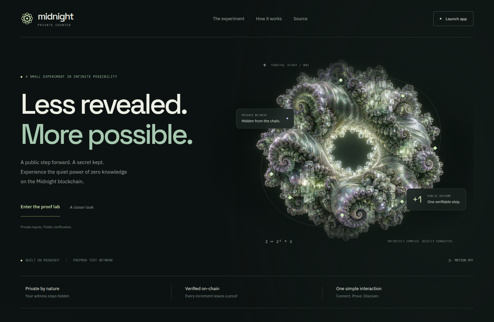
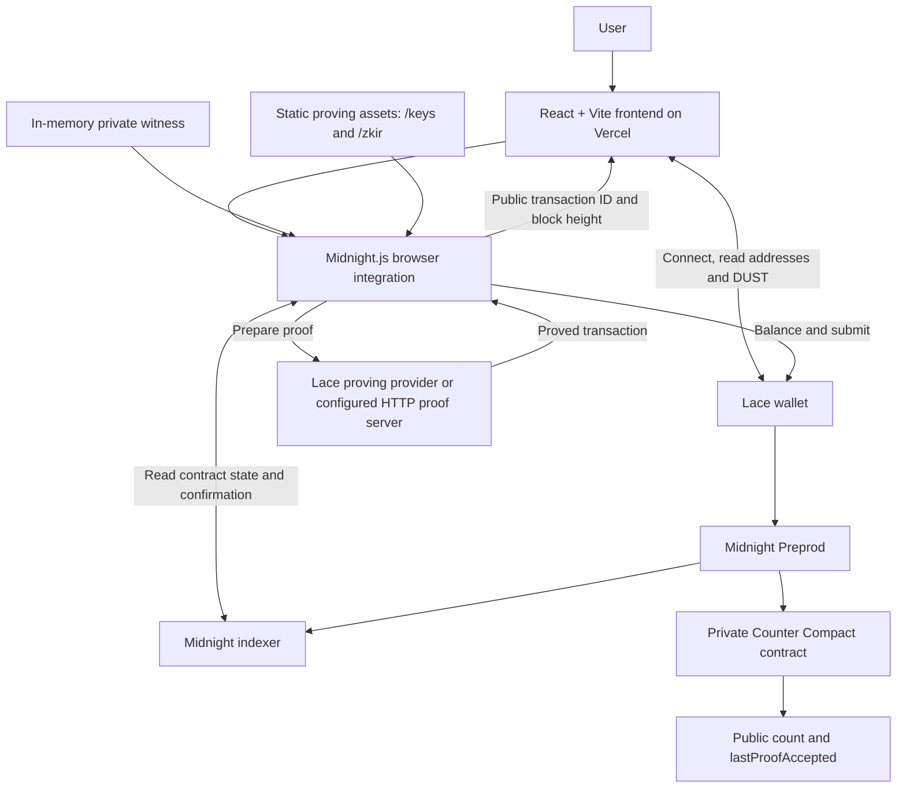
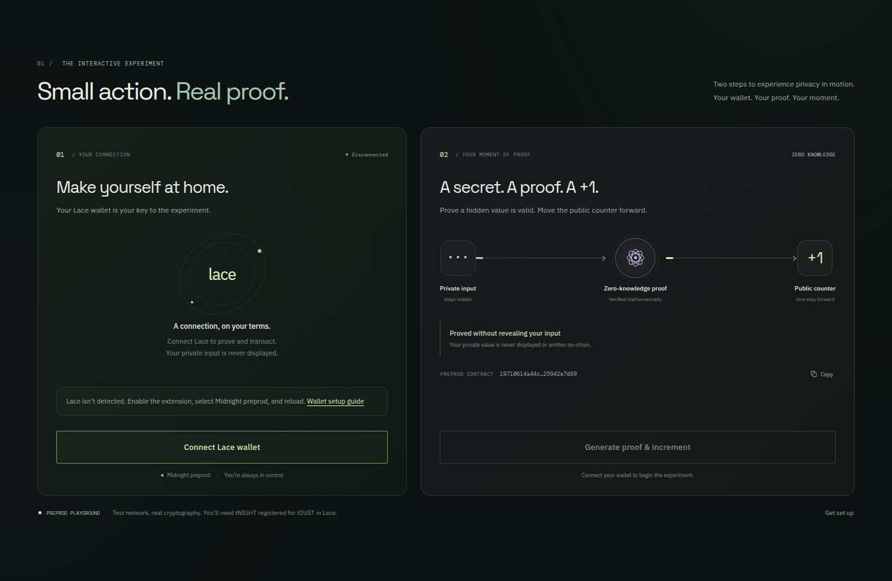
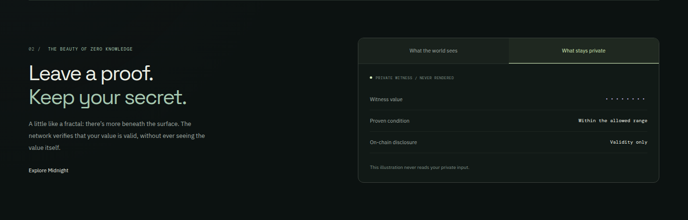
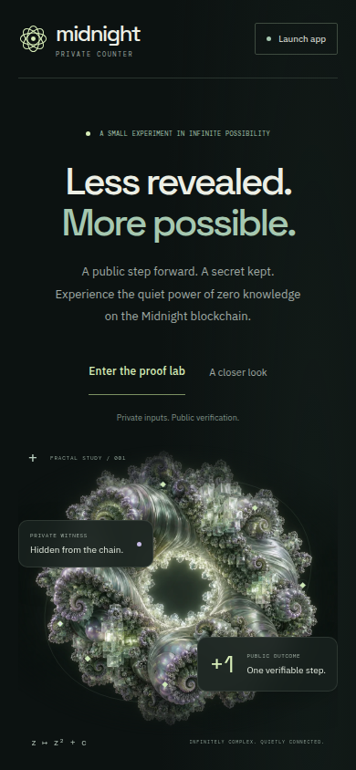
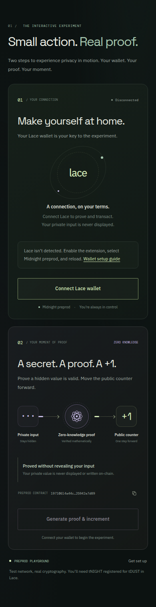
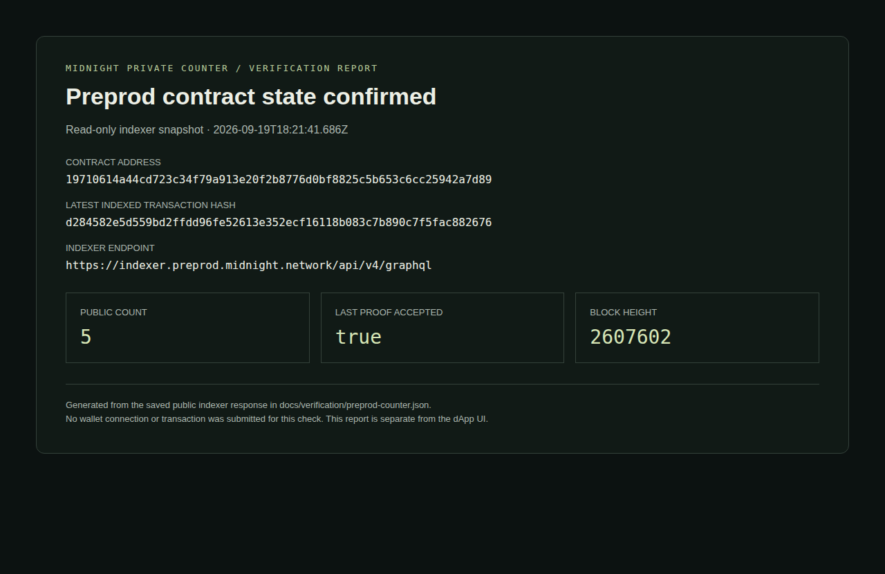

# Midnight Private Counter — Less Revealed. More Possible.


A privacy-preserving dApp that advances a public counter by proving a hidden value is valid. Connect Lace, generate a zero-knowledge proof, and confirm a real transaction on Midnight Preprod without publishing the private witness to the ledger.

**Compact Smart Contract · Zero-Knowledge Proofs · Midnight.js · React 19 · Lace Wallet · Midnight Preprod**

[Live Application](https://midnight-private-counter.vercel.app) · [Demo Video](https://youtu.be/Ai-zfJ9eokw) · [Source Code](https://github.com/ashuujha/midnight-private-counter) · [Screenshots](#9-screenshots) · [Verified Contract](#10-contract-addresses-and-on-chain-verification)



## Submission Checklist

| Requirement | Submission evidence |
|---|---|
| Public GitHub repository with README | [ashuujha/midnight-private-counter](https://github.com/ashuujha/midnight-private-counter) — public repository with this project guide |
| Live hosted demo | [Vercel application](https://midnight-private-counter.vercel.app) |
| Deployed, verifiable Preprod contract | `19710614a44cd723c34f79a913e20f2b8776d0bf8825c5b653c6cc25942a7d89` — [on-chain verification and reproducible query](#10-contract-addresses-and-on-chain-verification) |
| Demo video: wallet connection and a successful circuit call | [Watch the submitted demo on YouTube](https://youtu.be/Ai-zfJ9eokw) |
| README documenting the privacy claim | [Privacy claim and trust boundaries](#privacy-claim) |
| Minimum 8 meaningful commits | [17+ commits in the project history](https://github.com/ashuujha/midnight-private-counter/commits/main/) covering the contract, tests, deployment, wallet integration, proving fixes, and interface |

### Demo Video

**[Watch “Midnight network project” on YouTube](https://youtu.be/Ai-zfJ9eokw)**

The demonstration to review is the complete interaction: connect Lace on Preprod, select **Generate proof & increment**, and confirm that the successful circuit call displays a transaction ID and block height. The private witness should never appear in the interface.

## Table of Contents

1. [Product Overview and Problem Statement](#1-product-overview-and-problem-statement)
2. [Architecture](#2-architecture)
3. [Smart Contract Design](#3-smart-contract-design)
4. [Proof and Transaction Flow](#4-proof-and-transaction-flow)
5. [Features and Tech Stack](#5-features-and-tech-stack)
6. [Local Development and Testing](#6-local-development-and-testing)
7. [Deployment and CI Status](#7-deployment-and-ci-status)
8. [Privacy and Security Considerations](#8-privacy-and-security-considerations)
9. [Screenshots](#9-screenshots)
10. [Contract Addresses and On-Chain Verification](#10-contract-addresses-and-on-chain-verification)
11. [Resources and Links](#11-resources-and-links)
12. [Contributing](#12-contributing)
13. [License](#13-license)

## 1. Product Overview and Problem Statement

How can a public blockchain verify a condition without learning the private value that satisfies it? Midnight Private Counter makes that question tangible through one small interaction: prove that a hidden number is between **1 and 10**, then advance the public counter by **exactly one**.

| Challenge | How this dApp addresses it |
|---|---|
| Verifying a value can require exposing the value itself | A Compact circuit proves the range condition while keeping the witness out of public ledger state |
| Zero-knowledge concepts are difficult to see in practice | A two-step proof lab connects a wallet action to a real on-chain result |
| It is easy to confuse private inputs with public transaction data | An interactive explanation separates the hidden witness from the public counter transition and transaction metadata |
| Wallet readiness and proving failures can be hard to diagnose | The interface shows network, DUST balance, preparation/proving status, and actionable errors |

This is an educational test-network dApp. The browser generates an allowed value for each call; users do not enter a secret. The value determines whether the proof is valid, **not how much the counter increases**. Every successful call adds `1`, whether the private value is `1`, `7`, or `10`.

## 2. Architecture



### Component responsibilities

| Component | Responsibility | Source |
|---|---|---|
| Frontend | Landing page, wallet panel, proof lab, and public/private explanation | [`src/App.tsx`](src/App.tsx) |
| Wallet provider | Detects a compatible connector, connects Lace, validates the network, and reads addresses and DUST | [`src/hooks/useMidnight.ts`](src/hooks/useMidnight.ts) |
| Circuit interface | Loads the proving module on demand and displays pending, error, and confirmed states | [`src/components/CircuitCall.tsx`](src/components/CircuitCall.tsx) |
| Midnight integration | Creates providers, supplies the witness, calls `increment`, and returns public confirmation data | [`src/midnight/counter.ts`](src/midnight/counter.ts) |
| Private-state provider | Keeps browser-side witness state in memory | [`src/in-memory-private-state-provider.ts`](src/in-memory-private-state-provider.ts) |
| Compact contract | Enforces the range condition and updates public ledger state | [`contracts/counter.compact`](contracts/counter.compact) |

The deployed frontend is static. It uses the network configuration supplied by Lace and does not require an application database, GitHub OAuth, or a custom backend API. Proof generation uses either Lace's proving provider or the endpoint configured in `VITE_PROOF_SERVER_URL`.

## 3. Smart Contract Design

### 3.1 Private Counter

**Purpose:** prove that a private witness is in the inclusive range `[1, 10]`, increment a public counter, and disclose only the successful range-check result.

**Preprod contract address:**

```text
19710614a44cd723c34f79a913e20f2b8776d0bf8825c5b653c6cc25942a7d89
```

### 3.2 Public ledger state

| Field | Compact type | Meaning |
|---|---|---|
| `count` | `Counter` | Cumulative number of successful increments |
| `lastProofAccepted` | `Boolean` | Set to `true` by a successful range proof |

A rejected assertion does not increment the counter or set `lastProofAccepted` to `false`; it prevents that state transition from succeeding.

### 3.3 Private witness and circuit interface

| Interface | Kind | Behavior |
|---|---|---|
| `privateIncrement(): Uint<16>` | Private witness | Supplies the value from the caller's private state |
| `isAllowedIncrement(value: Uint<16>): Boolean` | Exported pure circuit | Checks `value >= 1 && value <= 10` without changing ledger state |
| `increment(): []` | Exported state-changing circuit | Reads the witness, asserts validity, increments `count`, and discloses acceptance |

The core implementation is deliberately small:

```compact
export ledger count: Counter;
export ledger lastProofAccepted: Boolean;

witness privateIncrement(): Uint<16>;

export pure circuit isAllowedIncrement(value: Uint<16>): Boolean {
    return value >= 1 && value <= 10;
}

export circuit increment(): [] {
    const secretValue = privateIncrement();
    const accepted = isAllowedIncrement(secretValue);

    assert(accepted, "Private increment must be between 1 and 10");

    count.increment(1);
    lastProofAccepted = disclose(accepted);
}
```

### 3.4 Compiled artifacts

The checked-in [`managed/counter/`](managed/counter/) directory contains the generated JavaScript bindings, TypeScript declarations, circuit IR, and proving/verifying keys. Its [compiler metadata](managed/counter/compiler/contract-info.json) records **Compact compiler 0.31.1**, **language 0.23.0**, and **runtime 0.16.0**.

[`scripts/copy-zk-assets.mjs`](scripts/copy-zk-assets.mjs) copies the circuit assets into `public/keys` and `public/zkir` before development and production builds. The frontend fetches them from its own origin when needed.

## 4. Proof and Transaction Flow

1. **Connect Lace.** The frontend requests a connection to `preprod`, verifies the returned network, and reads the wallet's unshielded address, DUST address, and DUST balance.
2. **Start the experiment.** Clicking **Generate proof & increment** imports the proving module and its WASM dependencies.
3. **Check readiness.** The integration checks the active connection, target network, DUST registration, and positive DUST balance.
4. **Prepare private state.** The browser uses `crypto.getRandomValues` to generate an allowed witness and stores it in the in-memory private-state provider.
5. **Load the deployed contract.** Midnight.js joins the configured contract through the indexer and the compiled circuit assets.
6. **Prove and submit.** `deployed.callTx.increment()` runs the proving flow. Lace balances and submits the transaction through the wallet adapters.
7. **Display confirmation.** The frontend receives only the public transaction ID and block height. It refreshes the DUST balance after success.

This flow uses **one application contract**, with the browser, prover, wallet, and indexer coordinating its invocation.

## 5. Features and Tech Stack

### Features

- Lace connection and disconnection with network validation.
- DUST readiness, manual balance refresh, and address-copy controls.
- Visible preparation, proving, failure, and confirmation states.
- A private witness that is never displayed by the UI or returned in its transaction result.
- Responsive desktop and mobile layouts with original fractal artwork.
- Public/private explanation tabs with keyboard navigation.
- Ambient animation controls and system reduced-motion support.
- Deferred proof SDK/WASM loading, minified production assets, and long-lived caching for hashed assets.

### Tech stack

| Layer | Technology used in this repository |
|---|---|
| Smart contract | Compact · compiler 0.31.1 · language 0.23.0 |
| Contract runtime | `@midnight-ntwrk/compact-runtime` 0.16.0 |
| Blockchain | Midnight Preprod; historical Preview deployment |
| dApp SDK | Midnight.js 4.1.1 · Compact.js 2.5.1 |
| Wallet connection | Lace · Midnight DApp Connector API 4.0.1 |
| Frontend | React 19.2.4 · TypeScript 5.9.3 · Vite 7.3.1 |
| Styling | Custom CSS · locally served fonts · WebP artwork |
| Application state | React hooks and Context |
| Proof server | `midnightntwrk/proof-server:8.1.0` for the documented local setup |
| Tests | Node.js test runner through `tsx` |
| Tooling | Node.js 22.x · npm |
| Hosting | Vercel static deployment |

## 6. Local Development and Testing

### Prerequisites

| Tool | Requirement |
|---|---|
| Node.js | **22.x**; the root package requires `>=22.0.0 <23` |
| npm | Install dependencies from the committed lockfile |
| Lace | Enable Midnight, select Preprod, and fund the wallet for transactions |
| Docker | Required when running a local proof server |
| Compact compiler | **0.31.1** to reproduce the checked-in contract artifacts; optional for frontend-only development |

See the [official toolchain installation guide](https://docs.midnight.network/getting-started/installation) for Compact and Docker setup. The repository includes compiled contract artifacts, so a frontend-only checkout can start without recompiling them.

### Clone and configure

```bash
git clone https://github.com/ashuujha/midnight-private-counter.git
cd midnight-private-counter
npm ci
cp .env.example .env.local
```

The default configuration targets the existing Preprod contract:

```dotenv
VITE_MIDNIGHT_NETWORK=preprod
VITE_CONTRACT_ADDRESS=19710614a44cd723c34f79a913e20f2b8776d0bf8825c5b653c6cc25942a7d89
```

| Variable | Purpose | Scope |
|---|---|---|
| `VITE_MIDNIGHT_NETWORK` | Network requested from Lace; defaults to `preprod` | Public, bundled into the browser build |
| `VITE_CONTRACT_ADDRESS` | Deployed counter's 64-character hexadecimal address | Public, bundled into the browser build |
| `VITE_PROOF_SERVER_URL` | Optional HTTP proof-provider endpoint; when omitted, proving is delegated to Lace | Public, bundled into the browser build |

Restart the development server after changing `.env.local`. Rebuild a deployed frontend when changing these values. Never put wallet seeds, recovery phrases, or private API credentials in `VITE_*` variables.

### Configure proving and wallet funding

For local proving, start the version used by this project:

```bash
docker run --rm -p 127.0.0.1:6300:6300 \
  midnightntwrk/proof-server:8.1.0 midnight-proof-server -v
```

Configure Lace's Midnight proof-server setting to use the local service. For a hosted frontend that uses a separately hosted proof server, set `VITE_PROOF_SERVER_URL` to its HTTPS URL; that service must allow requests from the frontend origin.

Fund the wallet with Preprod tNIGHT, use **Generate tDUST** in Lace to register it for DUST generation, and wait for a positive DUST balance and wallet synchronization. tNIGHT alone does not satisfy the app's DUST check. Follow the [official wallet-funding guide](https://docs.midnight.network/guides/acquire-tokens).

### Start the frontend

```bash
npm run dev
```

Open `http://localhost:5173`, connect Lace, and select **Generate proof & increment**. The pre-development script copies the checked-in proving assets automatically.

### Compile and validate

For contract development:

```bash
compact compile --version
npm run compile
```

Run the repository's checks:

```bash
npm run typecheck
npm test
npm run build
npm run preview
```

The production build copies proving assets, type-checks the application, and writes the frontend to `dist/`. The preview server defaults to `http://localhost:4173`.

The four tests in [`tests/counter.test.ts`](tests/counter.test.ts) check shared SDK runtime identity, the allowed range boundaries, public counter transitions, and exclusion of the private witness from public outputs. These are local contract simulations; they do not submit test-network transactions.

### Troubleshooting

| Symptom | Check |
|---|---|
| Lace is not detected | Enable the extension and Midnight support, then reload |
| Network mismatch | Switch Lace to Preprod and reconnect |
| No DUST registration or zero DUST | Complete **Generate tDUST**, wait for accrual and wallet sync, then refresh |
| Proof-server failure | Check the configured endpoint, proof-server version, and browser reachability |
| Missing `/keys` or `/zkir` assets | Run the root development/build scripts; they copy assets from `managed/counter` |
| `StateValue` or runtime incompatibility | Use the committed dependency lockfile and matching Compact artifacts |

## 7. Deployment and CI Status

### 7.1 Vercel frontend

The live application is hosted at **[midnight-private-counter.vercel.app](https://midnight-private-counter.vercel.app)**.

[`vercel.json`](vercel.json) configures the Vite framework, `npm install`, `npm run build`, and the `dist` output directory. Files under `/assets/` have content-hashed names and receive `Cache-Control: public, max-age=31536000, immutable`. The HTML remains revalidated so new deployments can reference new asset versions.

To deploy your own instance:

```bash
npx vercel@latest login
npx vercel@latest link
npx vercel@latest env add VITE_MIDNIGHT_NETWORK production
npx vercel@latest env add VITE_CONTRACT_ADDRESS production
```

Use `preprod` and the Preprod contract address listed below. If using a hosted proof endpoint, also add it:

```bash
npx vercel@latest env add VITE_PROOF_SERVER_URL production
```

Deploy the configured application:

```bash
npx vercel@latest --prod
```

Vercel hosts the frontend and static proving assets. It does not run the Docker proof server as part of this build.

### 7.2 Deploying a new counter contract

Redeployment is optional; running the frontend against the existing address does not require it. The deployment helper lives in `mn-demo/` and uses its own wallet and compiled-artifact directory.

From the repository root, prepare the helper:

```bash
npm --prefix mn-demo ci
compact compile contracts/counter.compact mn-demo/contracts/managed/counter
```

Configure and fund the helper's deployment wallet using the [deployment scaffold instructions](mn-demo/README.md). For a public test network, set `PRIVATE_STATE_PASSWORD` to a strong private-state password of at least 16 characters, and start the local proof server before deploying.

```bash
npm run deploy:preprod
# Alternatively, for the separate Preview network:
# npm run deploy:preview
```

The script deploys the counter and records the result in the helper's gitignored `.midnight-state.json`. Update `VITE_CONTRACT_ADDRESS` and rebuild the frontend to target your new contract. The helper wallet is separate from Lace unless you explicitly configure them to share an identity.

### 7.3 CI status

The repository currently contains a `.github/workflows/.gitkeep` placeholder, **not an implemented GitHub Actions CI/CD workflow**. The validation commands above are available to run locally or add to your own pipeline. Vercel deployment is configured independently through `vercel.json`.

## 8. Privacy and Security Considerations

### Privacy claim

The `increment` circuit proves that a private `Uint<16>` witness lies between **1 and 10** without publishing that witness in its public outputs or ledger state. An on-chain observer can see the public counter advance by one, the `lastProofAccepted` flag, and public transaction metadata. The disclosed range-check result does not identify which allowed value was used.

The UI receives only `transaction.public.txId` and `transaction.public.blockHeight` from a successful call. This claim concerns disclosure to the public ledger; it does not hide transaction metadata or remove the trust placed in the browser, wallet, and configured proof provider.

### Data visibility and trust boundaries

| Data | Visibility |
|---|---|
| `privateIncrement` | Private witness used during proving; not written into the public ledger or displayed by the UI |
| `count` and `lastProofAccepted` | Public ledger state |
| Contract address, transaction ID, and block height | Public verification metadata |
| Connected addresses and DUST balance | Read from Lace and shown to the connected user |

- **Enforced range condition:** the contract asserts the witness is between `1` and `10` before updating the counter. Frontend checks are not the source of that guarantee.
- **Deliberate disclosure:** `disclose(accepted)` publishes the successful Boolean result, not the witness value. The increment circuit returns an empty tuple.
- **Proof-provider trust:** privacy from the public ledger does not mean the witness is hidden from the configured prover. The HTTP provider sends proving inputs to the selected service; use a prover appropriate for the confidentiality of your inputs.
- **Demo private storage:** browser private state uses in-memory maps. The provider's export helpers serialize data; they do not implement encrypted backups, and the UI does not expose them.
- **Wallet isolation:** the frontend does not request a wallet seed or recovery phrase. Wallet changes and disconnection clear displayed results and prevent a late result from appearing under a different wallet.
- **Scope of the proof:** this proves a range condition, not identity, ownership, eligibility, or anonymity. The small generated value is a demonstration witness, not a high-entropy credential.
- **Deployment credentials:** the `mn-demo` helper can store wallet recovery material locally. Keep its state files and deployment credentials private and out of version control.

## 9. Screenshots

UI screenshots were captured from the live application on **19 September 2026**, at desktop and mobile viewport sizes. They show the real disconnected interface with reduced motion enabled for stable captures. The explanatory tabs contain static educational content; no wallet connection or successful transaction was simulated for these images.

### Desktop overview

The hero appears at the top of this README. [View the full desktop page](docs/screenshots/frontend-desktop.png).

### Proof lab — wallet connection and circuit controls



### Privacy explanation — what stays private



### Mobile views

<table>
  <tr>
    <th>Landing page</th>
    <th>Proof lab</th>
  </tr>
  <tr>
    <td valign="top"></td>
    <td valign="top"></td>
  </tr>
</table>

[View the full mobile page](docs/screenshots/frontend-mobile.png).

### Contract verification report

This report is generated from a read-only Preprod indexer response. It is separate from the dApp UI and backed by the [saved verification record](docs/verification/preprod-counter.json).



## 10. Contract Addresses and On-Chain Verification

### Recorded deployments

| Network | Contract address | Usage |
|---|---|---|
| **Preprod** | `19710614a44cd723c34f79a913e20f2b8776d0bf8825c5b653c6cc25942a7d89` | Default frontend configuration; verified below |
| Preview | `a63f722b44482e8d825e4fde801b6c39392019a7c3f2138d5d0e3fb2902665fd` | Historical deployment; not the default live-app network |

### Preprod verification snapshot

A read-only request to the Preprod indexer returned the following on **19 September 2026 at 18:21 UTC**:

| Field | Observed value |
|---|---|
| Latest indexed action | `ContractCall` |
| Public `count` | `5` |
| Public `lastProofAccepted` | `true` |
| Block height | `2607602` |
| Latest indexed transaction hash | `d284582e5d559bd2ffdd96fe52613e352ecf16118b083c7b890c7f5fac882676` |

The public ledger was decoded using the checked-in counter bindings and the matching Midnight runtime. This is a point-in-time observation of an existing transaction, not a new deployment or a transaction submitted during documentation work. Later calls can change these values.

### Reproduce the read-only query

```bash
curl --fail-with-body --silent --show-error \
  https://indexer.preprod.midnight.network/api/v4/graphql \
  -H 'Content-Type: application/json' \
  --data-binary @- <<'JSON'
{
  "query": "query VerifyCounter($address: HexEncoded!) { contractAction(address: $address) { __typename address state transaction { hash block { height } } } }",
  "variables": {
    "address": "19710614a44cd723c34f79a913e20f2b8776d0bf8825c5b653c6cc25942a7d89"
  }
}
JSON
```

The response includes serialized public contract state in `state`, plus the latest indexed transaction and block. The raw response and decoded snapshot are preserved in [`docs/verification/preprod-counter.json`](docs/verification/preprod-counter.json).

## 11. Resources and Links

| Resource | Link |
|---|---|
| Live application | [midnight-private-counter.vercel.app](https://midnight-private-counter.vercel.app) |
| Demo video | [Midnight network project — YouTube](https://youtu.be/Ai-zfJ9eokw) |
| Source repository | [ashuujha/midnight-private-counter](https://github.com/ashuujha/midnight-private-counter) |
| Commit history | [Implementation and documentation commits](https://github.com/ashuujha/midnight-private-counter/commits/main/) |
| Midnight documentation | [docs.midnight.network](https://docs.midnight.network/) |
| Compact language | [Compact documentation](https://docs.midnight.network/compact) |
| Toolchain installation | [Install Compact and the proof server](https://docs.midnight.network/getting-started/installation) |
| Wallet setup | [Lace](https://www.lace.io/) |
| Test-network funding | [tNIGHT and DUST guide](https://docs.midnight.network/guides/acquire-tokens) |
| Preprod faucet | [Nethermind Preprod faucet](https://midnight-tmnight-preprod.nethermind.dev) |
| Deployment tooling | [mn-demo setup and wallet configuration](mn-demo/README.md) |

## 12. Contributing

1. Fork the repository and create a focused feature branch.
2. Install dependencies with `npm ci` and configure `.env.local`.
3. Make the change and run `npm run typecheck`, `npm test`, and `npm run build`.
4. For Compact changes, run `npm run compile` first and include the corresponding generated artifacts. Recompile into `mn-demo/contracts/managed/counter` if testing the deployment helper.
5. Check desktop/mobile layouts and reduced-motion behavior for interface changes.
6. Open a pull request describing the change, validation, and any contract or configuration impact. Include screenshots for visible changes.

Keep private witnesses, wallet credentials, and local state files out of commits and screenshots. Preserve the distinction between public transaction results and private proving inputs.

## 13. License

The repository does not currently include a project-wide `LICENSE` file. The `mn-demo` scaffold declares MIT in its package metadata; that declaration alone does not establish a license for the entire dApp. Bundled fonts include their own license files in [`public/fonts/`](public/fonts/).

---

© Ashutosh Jha
