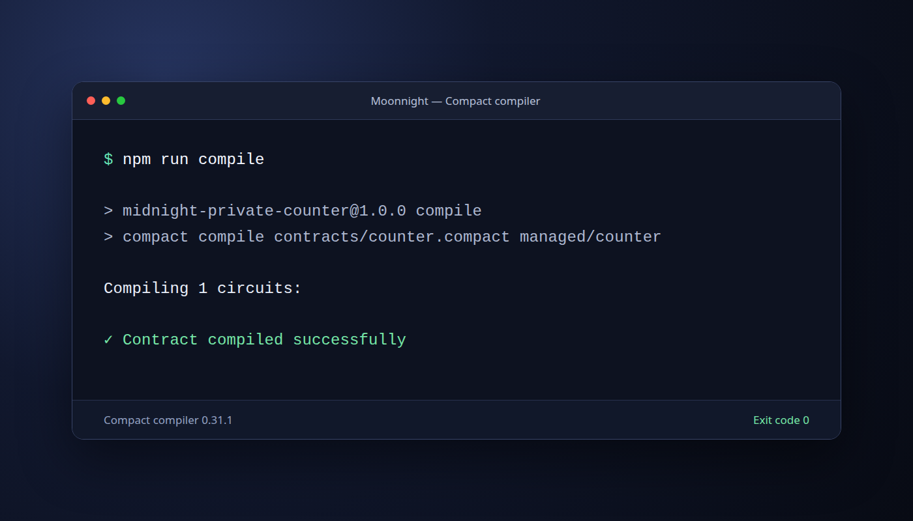
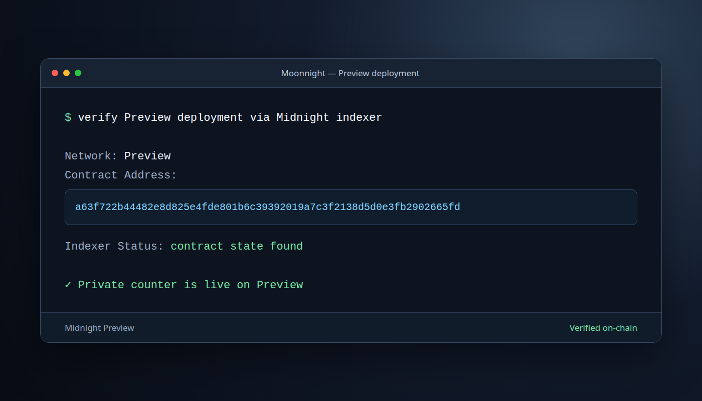

# Midnight Private Counter
> A privacy-preserving dApp that advances a public counter after proving a hidden value is valid.

## Live Demo

**[midnight-private-counter.vercel.app](https://midnight-private-counter.vercel.app)**

## Contract Address

| Network | Address |
|---|---|
| Preprod | `19710614a44cd723c34f79a913e20f2b8776d0bf8825c5b653c6cc25942a7d89` |

## What This Does

Midnight Private Counter connects to Lace and calls the deployed contract's `increment` circuit. For every call, the browser creates an allowed private witness in memory. The Compact circuit proves that the witness is between 1 and 10, increments the public counter by one, and deliberately discloses only whether the range proof succeeded.

The interface shows wallet connection state, proof-generation progress, and the confirmed transaction ID and block height. It never asks for, renders, logs, or returns the private witness value.

## Privacy Model

- What is **PUBLIC**: the contract address, submitted transaction, block height, public `count`, and `lastProofAccepted` Boolean.
- What is **PRIVATE**: the randomly generated `privateIncrement` witness. It exists only in the browser's in-memory private-state provider while the call is prepared.
- What the user **PROVES without revealing**: that the private value is within the inclusive range 1 through 10 and therefore authorizes one counter increment.

The frontend serves the compiled circuit material from `/keys` and `/zkir`. Midnight.js runs the proving flow from the browser using the proof server configured in Lace, then Lace balances and submits the finalized transaction.

## Privacy Claim

An on-chain observer sees that the `increment` circuit succeeded, the public counter advanced by one, and `lastProofAccepted` became true. The observer cannot see the private witness, determine which allowed value was used, or recover it from the transaction result. The frontend reads only `transaction.public` and never sends private call data to the UI, analytics, or logs.

## Tech Stack

- Midnight network Preprod
- Compact language and Compact compiler
- Midnight.js SDK 4.1.1
- Midnight DApp Connector API 4.0.1
- React 19 and Vite 7
- Lace wallet
- TypeScript and Node.js v22

## Prerequisites

- Node.js v22 and npm
- Lace wallet installed, configured for Midnight Preprod, and funded with Preprod tNIGHT and DUST
- Docker Desktop for the local Midnight proof server
- Compact compiler for contract development

Start the Ledger 8.1 proof server and configure Lace to use `http://127.0.0.1:6300` when running the dApp locally:

```bash
docker pull midnightntwrk/proof-server:8.1.0
docker run --rm -p 6300:6300 midnightntwrk/proof-server:8.1.0
```

Set `VITE_PROOF_SERVER_URL` to an HTTPS proof-server endpoint for a hosted frontend. Without that variable, the frontend delegates proving to Lace through `getProvingProvider()`, which is suitable for local development.

## Run Locally

Clone the repository and install dependencies:

```bash
git clone https://github.com/ashuujha/midnight-private-counter.git
cd midnight-private-counter
npm install
```

Create a local environment file containing the deployed contract:

```bash
cp .env.example .env.local
```

Set these values in `.env.local`:

```dotenv
VITE_MIDNIGHT_NETWORK=preprod
VITE_CONTRACT_ADDRESS=19710614a44cd723c34f79a913e20f2b8776d0bf8825c5b653c6cc25942a7d89
```

Compile the contract and start the frontend:

```bash
npm run compile
npm run dev
```

Open the printed local URL, connect Lace, and approve the Preprod connection request.

## Run Tests

```bash
npm test
npm run build
```

The contract test suite covers circuit validation, state transitions, and witness privacy. The production build type-checks the browser integration and packages the proving assets.

## Deploy Frontend

The repository includes `vercel.json`. Deploy the production build with:

```bash
npm install
npm run build
npx vercel@latest login
npx vercel@latest link
npx vercel@latest env add VITE_MIDNIGHT_NETWORK production
npx vercel@latest env add VITE_CONTRACT_ADDRESS production
npx vercel@latest --prod
```

Enter `preprod` for `VITE_MIDNIGHT_NETWORK` and the address from the Contract Address table for `VITE_CONTRACT_ADDRESS`.

## Demo Video

`[PLACEHOLDER — add the demo video link after recording]`

Record a video under two minutes that shows:

1. Open the live demo with Lace on Preprod and click **Connect Lace wallet**.
2. Show the connected wallet address appear, then briefly disconnect and reconnect.
3. Click **Generate proof & increment** and keep the local proof-generation loading state visible.
4. Show the confirmed on-chain transaction ID and block height.
5. Point to **Proved without revealing your input** and explain that no private value appeared anywhere in the interface.

## Level 1 Contract Development

Compile and test the Compact contract independently:

```bash
npm run compile
npm test
```

The original Preview deployment is `a63f722b44482e8d825e4fde801b6c39392019a7c3f2138d5d0e3fb2902665fd`.

## Screenshots

### Successful Compact compilation



### Preview contract deployment


